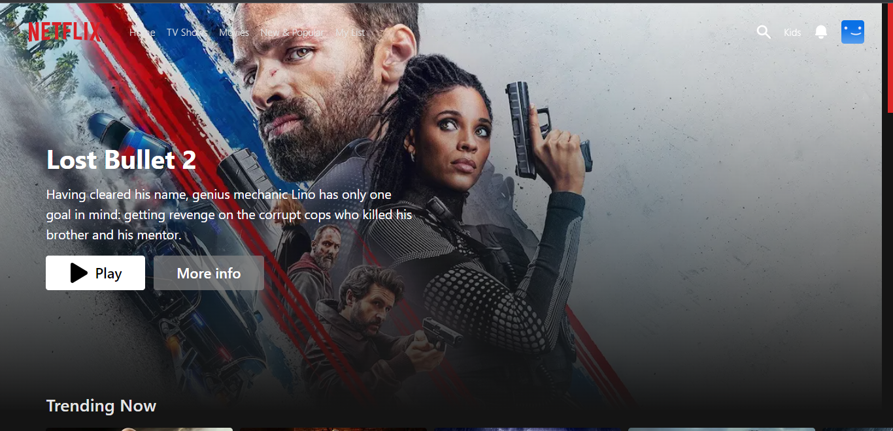
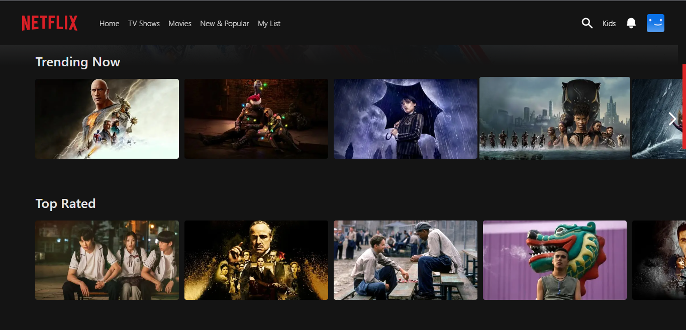
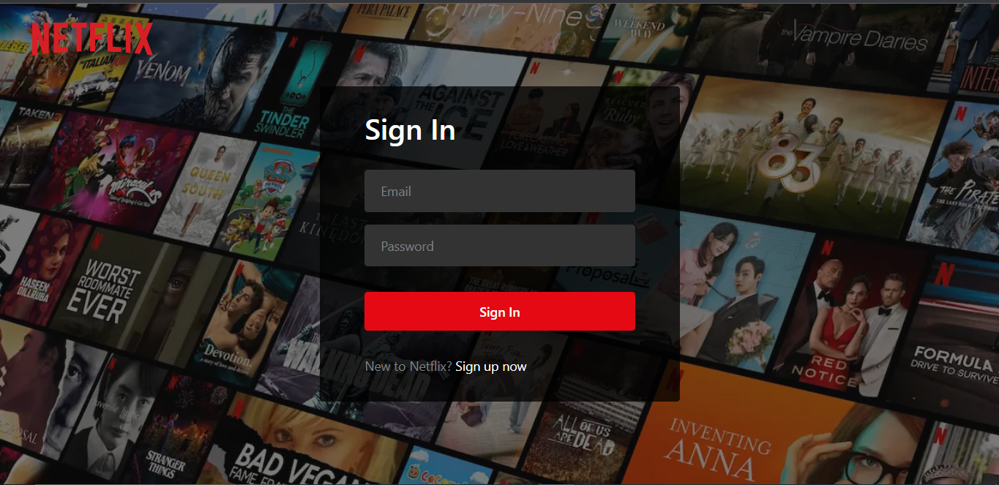

# Netflix Website

Netflix Website redesign and developed using Next, Recoil, Typescript and Firebase.

## Features

- Users can visit the website and view trailers of movies
- Authentication using firebase
- State management system using Recoil

## Tech

This application uses a number of open source projects to work properly:

- [Next] - Next.js is an open-source web development framework created by Vercel enabling React-based web applications with server-side rendering and generating static websites.
- [Typescript] - It is a strict syntactical superset of JavaScript and adds optional static typing to the language. It is designed for the development of large applications and transpiles to JavaScript.
- [Recoil] - Recoil is an experimental state management library and It provides several capabilities that are difficult to achieve with React alone.In this article we learn about the recoil. js, and how it is managing state in react. JavaScript React Recoil. Recoil js is another state management library for React.
- [Firebase] - Firebase is a set of hosting services for any type of application. It offers NoSQL and real-time hosting of databases, content, social authentication, and notifications, or services, such as a real-time communication server.

And of course this application itself is open source with every code available here in github.

## Installation

Requires [Node.js](https://nodejs.org/) v10+ to run.

Install the dependencies and start the server.

```sh
npm install
npm start
```

## Screenshot

##### Home


##### Genres


##### Authentication Page


## Performance Test


## Hosted
The link for the finished website - [Click Here](https://next-typescript-apple-redesign.vercel.app/)

<!-- ## License

MIT -->
